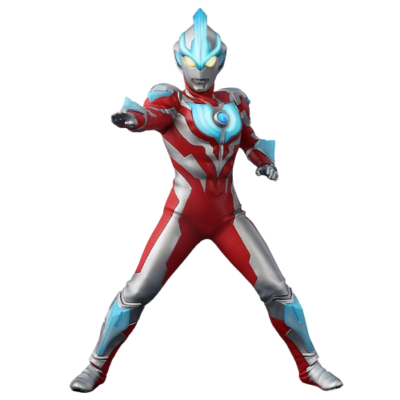

<!DOCTYPE html>
<html lang="en">
<head>
  <meta charset="UTF-8">
  <title>Gin's Candy</title>

  <!-- PIXEL FONT dari Google Fonts -->
  <link href="https://fonts.googleapis.com/css2?family=Press+Start+2P&display=swap" rel="stylesheet">

  
</head>
<body>

  <button>Tambah Permen</button>

  
  

  
It's ur candy, babe!!

  

</body>
</html>
